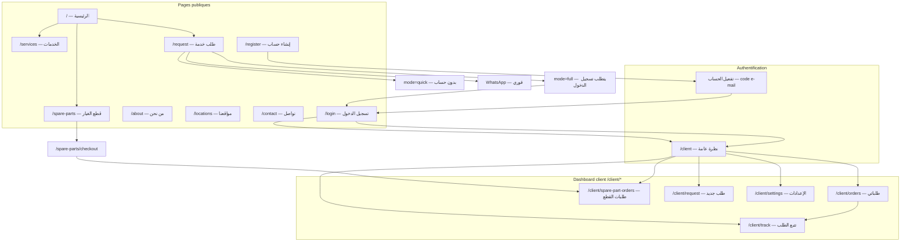
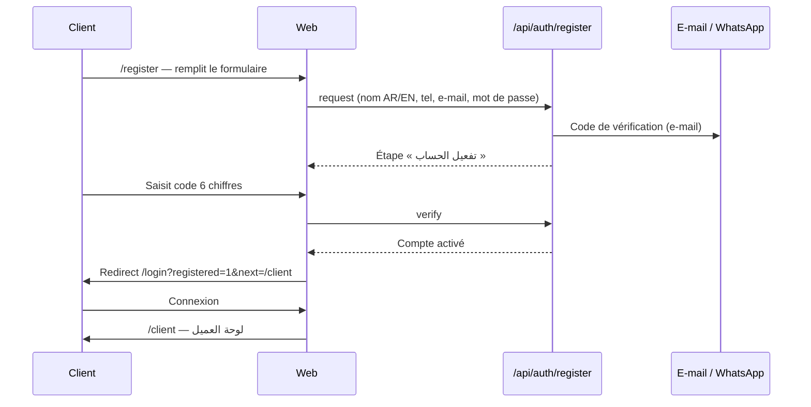
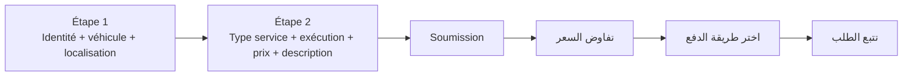
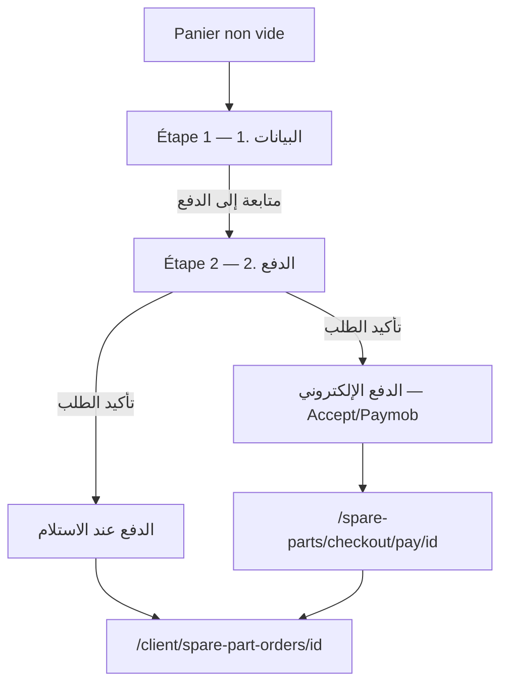
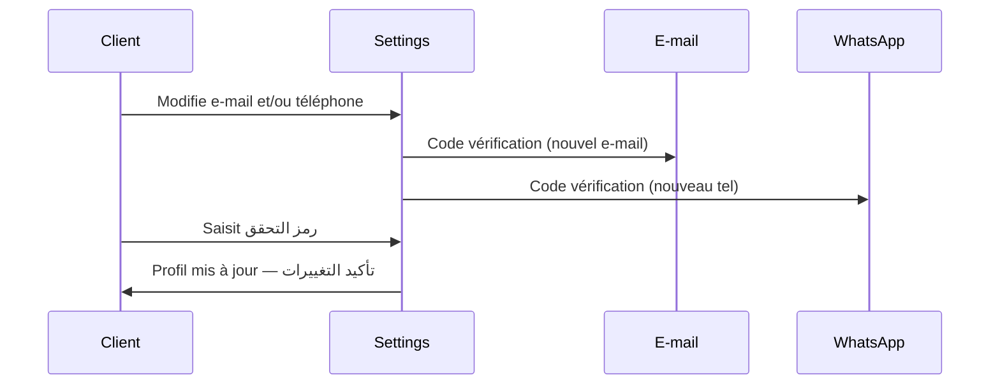

# Service Time — Parcours client (Customer Journey)

> Document de référence pour le parcours **client / عميل** sur la plateforme web **Service Time** (Riyadh, Arabie saoudite).  
> Dérivé du code actuel dans `apps/web` — dernière révision : juin 2026.

---

## 1. Vue d'ensemble

| | |
|---|---|
| **Produit** | Plateforme de maintenance automobile et vente de pièces détachées |
| **Marché** | Riyadh — interface **arabe-first** (RTL) + anglais |
| **Rôle client** | Compte `client` actif sur Supabase Auth |
| **Application** | PWA Next.js (`apps/web`) |

### Personas

| Persona | Description | Parcours principal |
|---------|-------------|-------------------|
| **Visiteur** | Découvre le site sans compte | Accueil → Services → Contact / WhatsApp |
| **Client invité (quick)** | Demande rapide sans inscription | `/request?mode=quick` |
| **Client inscrit** | Compte vérifié par e-mail | Dashboard, commandes, pièces, tracking |
| **Client mixte** | Quick request → compte auto-créé | Inscription implicite + e-mail de bienvenue |

---

## 2. Carte des touchpoints



---

## 3. Navigation publique

| Route | Label AR | Label EN | Auth |
|-------|----------|----------|------|
| `/` | الرئيسية | Home | Non |
| `/services` | الخدمات | Services | Non |
| `/request` | طلب خدمة | Request Service | Selon mode |
| `/spare-parts` | قطع الغيار | Spare Parts | Non (checkout : oui) |
| `/locations` | مواقعنا | Locations | Non |
| `/about` | من نحن | About Us | Non |
| `/contact` | تواصل | Contact | Non |
| `/login` | تسجيل الدخول | Sign In | Non |
| `/register` | إنشاء حساب | Create Account | Non |

**Header commun :** logo, navigation, sélecteur de langue (AR/EN), panier pièces (si articles), bouton connexion.

---

## 4. Parcours A — Découverte et conversion

### Étape 1 : Accueil (`/`)

| Action client | Résultat |
|---------------|----------|
| Lit le hero (CMS `home.hero`) | Comprend l'offre : atelier fixe ou service mobile |
| Parcourt services vedettes | 6 services max |
| Parcourt pièces récentes | 6 pièces max → lien `/spare-parts` |
| Voit les ateliers | Aperçu des emplacements |
| CTA « ابدأ الآن » | Redirection → `/request` |

### Étape 2 : Services (`/services`)

| Action client | Résultat |
|---------------|----------|
| Carousel hero (3 slides) | Maintenance périodique, urgence, pièces |
| Grille de services | Cartes avec catégorie et description |
| « ابدأ طلب الخدمة » | → `/request` |

### Étape 3 : À propos & Contact

| Page | Actions clés |
|------|--------------|
| `/about` | Vision, mission, valeurs (CMS + carousel) |
| `/contact` | Formulaire (nom*, téléphone*, e-mail, message*) + coordonnées + Google Maps |
| `/locations` | Carte intégrée + fiches ateliers avec directions |

---

## 5. Parcours B — Création de compte



### Champs inscription

| Champ | Obligatoire | Validation |
|-------|-------------|------------|
| Nom complet (AR) | Oui | — |
| Nom complet (EN) | Oui | — |
| Téléphone | Oui | Mobile MA/SA |
| E-mail | Oui | Format e-mail |
| Mot de passe | Oui | 8+ caractères |
| Confirmation | Oui | = mot de passe |
| Avatar | Non | JPG/PNG/WebP ≤ 5 Mo |

### Connexion (`/login`)

| Action | Détail |
|--------|--------|
| Identifiant | E-mail **ou** numéro de mobile |
| Mot de passe | — |
| Mot de passe oublié | E-mail → code 6 chiffres → nouveau mot de passe |
| Succès | Redirection selon rôle ; paramètre `?next=` respecté pour le client |
| Déjà connecté | Redirect automatique vers `/client` |

---

## 6. Parcours C — Demande de service

### Hub de choix (`/request`)

| Mode | URL | Label AR | Auth |
|------|-----|----------|------|
| Complet | `?mode=full` | أرسل طلب الصيانة | Client actif |
| Rapide | `?mode=quick` | طلب سريع | Aucune |
| WhatsApp | `?mode=whatsapp` | تواصل سريع عبر واتساب | Aucune |

### C.1 — Demande complète (client connecté)

**Routes :** `/request?mode=full` · `/client/request` · formulaire embarqué dans `/client/orders`



#### Étape 1 — Informations

| Champ | Label AR |
|-------|----------|
| Nom | الاسم الكامل |
| Téléphone | رقم الجوال |
| Véhicule | Véhicule enregistré ou nouveau (marque, modèle, année, plaque) |
| Localisation | Adresse + carte GPS (lat/lng) |

#### Étape 2 — Service

| Champ | Options |
|-------|---------|
| Type | `periodic_maintenance` · `emergency` |
| Exécution | `workshop_visit` (atelier) · `mobile_workshop` (mobile) |
| Prix proposé | Montant SAR (obligatoire — base de négociation) |
| Description | Texte libre |
| Photo | Optionnelle |

#### Après soumission

| Événement | Destination |
|-----------|-------------|
| Succès | `/client/track/{token}?success=1` |
| N° de suivi | `tracking_token` unique |

### C.2 — Négociation de prix (quote)

| Statut | Label AR | Action client |
|--------|----------|---------------|
| `pending_admin` | بانتظار مراجعة المدير | Attendre |
| `admin_countered` | عرض مقابل من الإدارة | **قبول العرض المقابل** ou refuser |
| `accepted` | تم الاتفاق على السعر | Passer au paiement |
| `declined` | مرفوض | Fin du flux ou nouvelle demande |

**Où :** `/client/orders/[id]` · `/client/track/[token]`

### C.3 — Demande rapide (sans compte)

| Champ | Obligatoire |
|-------|-------------|
| Nom | Oui |
| Téléphone | Oui |
| E-mail | Oui |
| Message | Oui |
| Photo | Non |

**Résultat :** enregistrement en table quick request ; création automatique de compte client si e-mail nouveau + notification de bienvenue.

### C.4 — WhatsApp

| Action | Résultat |
|--------|----------|
| Clic direct | Ouvre WhatsApp Business avec message prérempli |
| Formulaire optionnel | Nom / tel / message → WhatsApp |

---

## 7. Parcours D — Pièces détachées (قطع الغيار)

### D.1 — Catalogue (`/spare-parts`)

| Action | Détail |
|--------|--------|
| Parcourir | Pagination, recherche, filtres catégorie |
| Détail produit | Modal : prix, stock, description |
| Ajouter au panier | Bloqué si rupture de stock |
| Panier | Drawer « سلة قطع الغيار » — ajuster quantités, vider |

**Stockage panier :** localStorage (côté navigateur).

### D.2 — Checkout en 2 étapes (`/spare-parts/checkout`)

**Auth requise :** client actif (middleware + garde client).



#### Étape 1 — Données client (préremplies depuis le profil)

| Champ | Label AR |
|-------|----------|
| Nom complet | الاسم الكامل * |
| Téléphone | رقم الجوال * |
| E-mail | البريد الإلكتروني * |
| Adresse de livraison | عنوان التوصيل * |

#### Étape 2 — Paiement et confirmation

| Élément | Détail |
|---------|--------|
| Récapitulatif | Articles, quantités, total SAR |
| Mode paiement | **الدفع عند الاستلام** (défaut) ou **الدفع الإلكتروني** |
| Notes | Optionnel |
| Bouton | **تأكيد الطلب** |

#### Après commande

| Mode | Redirection | Statut paiement |
|------|-------------|-----------------|
| COD | `/client/spare-part-orders/{id}?success=1` | `pending` |
| En ligne | `/spare-parts/checkout/pay/{id}` → Paymob | `pending` → `paid` (webhook) |

**Panier vidé** automatiquement sur page succès (`?success=1`).

### D.3 — Suivi commande pièces

**Route :** `/client/spare-part-orders` — **طلبات القطع**

| Colonne / info | Contenu |
|----------------|---------|
| Code commande | `order_token` |
| Statut | pending → confirmed → preparing → shipped → delivered / cancelled |
| Paiement | Méthode + statut (pending / paid / failed) |
| Détail | Client, adresse livraison, lignes, total |

---

## 8. Parcours E — Paiement

### E.1 — Paiement service (après accord de prix)

| Méthode | Code | Label AR | Flux |
|---------|------|----------|------|
| Espèces | `cash_on_delivery` | الدفع عند الخدمة | Sélection → assignation technicien possible |
| En ligne | `online` | دفع إلكتروني | Paymob Accept → retour → tracking `?payment=1` |

**Page paiement service :** `/client/requests/pay/{requestId}` ou bouton inline sur tracking.

**Moyens Paymob affichés :** MADA, Visa/Mastercard, Apple Pay, Tabby, Tamara.

### E.2 — Paiement pièces

| Méthode | Label AR | Page |
|---------|----------|------|
| COD | الدفع عند الاستلام | Détail commande directement |
| En ligne | الدفع الإلكتروني | `/spare-parts/checkout/pay/{orderId}` → **ادفع الآن — Accept** |

---

## 9. Parcours F — Suivi de commande service (Tracking)

> **Important :** le tracking est **réservé aux clients connectés**.  
> Les anciennes URLs `/track` redirigent vers `/login?next=/client/track`.

### Entrées

| Point d'entrée | Route |
|----------------|-------|
| Hub tracking | `/client/track` |
| Lien direct | `/client/track/{token}` |
| Tableau commandes | Bouton **تتبع** |
| Notification SMS/WhatsApp | `{APP_URL}/client/track/{token}` |
| Après nouvelle demande | Redirect auto avec token |

### Page tracking (`/client/track/[token]`)

| Bloc | Label AR | Contenu |
|------|----------|---------|
| Résumé | تتبع حالة طلبك | Client, véhicule, type service, statut |
| Timeline | مراحل الطلب | Historique des statuts |
| Carte live | موقع الفني | Si `on_the_way` ou `arrived` : position technicien, ETA, distance |
| Quote | تفاوض السعر | Si en cours de négociation |
| Paiement | — | Si prix accepté |

### Statuts service (ordre typique)

```
received → assigned → in_progress → on_the_way → arrived → completed
                                                              ↘ cancelled
```

---

## 10. Parcours G — Dashboard client

### Menu latéral (`dashboard.client`)

| Route | Label AR | Fonction |
|-------|----------|----------|
| `/client` | نظرة عامة | KPIs, dernière commande, actions rapides |
| `/client/orders` | طلباتي | Liste + filtre + création inline |
| `/client/spare-part-orders` | طلبات القطع | Commandes pièces |
| `/client/request` | طلب جديد | Formulaire service complet |
| `/client/track` | تتبع الطلب | Recherche par token |
| `/client/settings` | الإعدادات | Profil, sécurité, vérification contact |

### Vue d'ensemble (`/client`)

| Widget | Description |
|--------|-------------|
| Statistiques | Total / actives / en route / terminées (filtre période) |
| Actions rapides | طلب جديد · جميع طلباتي · تتبع الطلب |
| Dernière commande | Statut + bannière financière (prix / paiement) + mini-carte si technicien en route |

---

## 11. Parcours H — Paramètres compte (`/client/settings`)

### Profil — الملف الشخصي

| Action | Détail |
|--------|--------|
| Modifier avatar | Upload ≤ 5 Mo |
| Noms AR / EN | Éditables |
| Téléphone | Éditable — **vérification WhatsApp** si changement |
| E-mail | Affiché ; changement → **code e-mail** |
| Enregistrer | **حفظ الملف** |

### Vérification contact (changement e-mail ou téléphone)



### Mot de passe — كلمة المرور

| Champ | Règle |
|-------|-------|
| Mot de passe actuel | Obligatoire |
| Nouveau | 8+ caractères |
| Confirmation | Identique |
| Action | **تغيير كلمة المرور** |

---

## 12. Notifications client (canaux)

| Événement | Canaux possibles |
|-----------|------------------|
| Création compte | E-mail + WhatsApp (bienvenue) |
| Code vérification inscription | E-mail |
| Changement contact (settings) | E-mail + WhatsApp |
| Création commande service | WhatsApp / SMS (lien tracking) |
| Changement statut | WhatsApp / SMS |
| Paiement confirmé | Redirect web + statut dashboard |

> Journal technique : table `notifications_log` (admin).

---

## 13. Matrice Auth × Fonctionnalité

| Fonctionnalité | Visiteur | Client connecté |
|----------------|----------|-----------------|
| Voir catalogue services/pièces | ✅ | ✅ |
| Panier pièces | ✅ | ✅ |
| Checkout pièces | ❌ | ✅ |
| Demande service complète | ❌ | ✅ |
| Demande rapide | ✅ | ✅ |
| Tracking live | ❌ | ✅ |
| Négociation prix | ❌ | ✅ |
| Paiement en ligne | ❌ | ✅ |
| Dashboard | ❌ | ✅ |
| Paramètres + véhicules | ❌ | ✅ |

---

## 14. Points de friction & bonnes pratiques

| Point | Recommandation |
|-------|----------------|
| Checkout pièces sans compte | Rediriger vers `/login?next=/spare-parts/checkout` |
| Tracking sans compte | Lien notification → login → tracking |
| Langue | Cookie `service-time-locale` — AR par défaut |
| Mobile | PWA installable ; formulaires en 2 étapes sur petit écran |
| Paiement Paymob | Variables `PAYMOB_*` + `NEXT_PUBLIC_APP_URL` requises |

---

## 15. Glossaire AR ↔ FR

| Arabe | Français |
|-------|----------|
| الرئيسية | Accueil |
| الخدمات | Services |
| طلب خدمة | Demande de service |
| قطع الغيار | Pièces détachées |
| طلبات القطع | Commandes pièces |
| طلباتي | Mes commandes |
| تتبع الطلب | Suivi de commande |
| لوحة العميل | Tableau de bord client |
| الدفع عند الاستلام | Paiement à la livraison |
| الدفع الإلكتروني | Paiement en ligne |
| الدفع عند الخدمة | Paiement à la prestation |
| تفاوض السعر | Négociation de prix |
| عنوان التوصيل | Adresse de livraison |
| إتمام الطلب | Finaliser la commande |

---

## 16. Fichiers code de référence

| Domaine | Fichiers principaux |
|---------|---------------------|
| Routes publiques | `apps/web/app/page.tsx`, `request/`, `spare-parts/` |
| Dashboard client | `apps/web/app/client/` |
| Auth | `apps/web/app/login/`, `register/`, `api/auth/` |
| Checkout pièces | `components/spare-parts/spare-parts-checkout-form.tsx` |
| Tracking | `apps/web/app/client/track/` |
| Settings | `components/settings/dashboard-settings-panel.tsx` |
| i18n | `apps/web/messages/ar.ts`, `en.ts` |
| Middleware auth | `apps/web/middleware.ts` |
| Paiement Paymob | `apps/web/app/api/payments/paymob/` |

---

*Document interne Service Time — parcours client web MVP+. Pour le schéma base de données, voir `docs/database.md`. Pour le périmètre technique initial, voir `ServiceTime_Technical_Scope.md`.*
