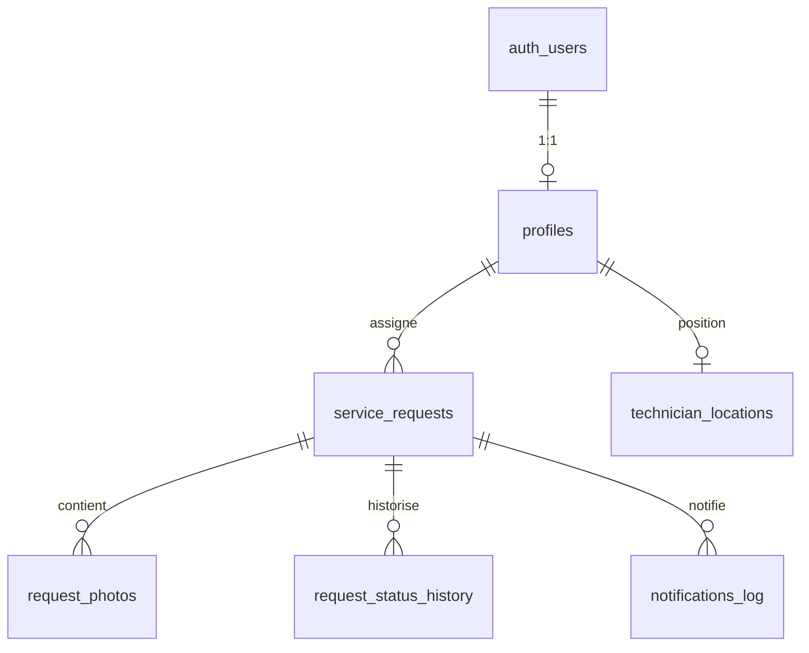

# Service Time — Schéma base de données

> Dérivé de `ServiceTime_Technical_Scope.md` — MVP Supabase / Postgres avec RLS.

## Vue d'ensemble

| Table | Description |
|---|---|
| `profiles` | Admins et techniciens (lié à `auth.users`) |
| `services` | Catalogue de services (CMS) |
| `spare_parts` | Catalogue de pièces détachées (CMS) |
| `service_requests` | Demandes clients — table centrale |
| `request_photos` | Photos jointes aux demandes (Storage) |
| `request_status_history` | Historique des statuts + timeline tracking |
| `technician_locations` | Position GPS live des techniciens |
| `site_content` | Contenu CMS (textes, images, contact) |
| `notifications_log` | Journal WhatsApp / SMS |

## Enums

### `profile_role`
`admin` | `technician`

### `technician_type`
`workshop` | `mobile`

### `service_type`
`periodic_maintenance` | `emergency` | `spare_parts`

### `execution_method`
`workshop_visit` | `mobile_workshop`

### `request_status`
`received` → `in_progress` → `on_the_way` → `arrived` → `completed` (+ `cancelled`)

### `request_priority`
`low` | `normal` | `high`

### `notification_channel`
`whatsapp` | `sms`

---

## Tables

### `profiles`

Admins et techniciens authentifiés.

| Colonne | Type | Notes |
|---|---|---|
| `id` | `uuid` PK | FK → `auth.users(id)` ON DELETE CASCADE |
| `full_name` | `text` NOT NULL | |
| `phone` | `text` | |
| `role` | `profile_role` NOT NULL | |
| `technician_type` | `technician_type` | NULL pour admin |
| `is_active` | `boolean` DEFAULT true | |
| `created_at` | `timestamptz` | |
| `updated_at` | `timestamptz` | |

### `services`

| Colonne | Type | Notes |
|---|---|---|
| `id` | `uuid` PK | |
| `name_ar` | `text` NOT NULL | |
| `description_ar` | `text` | |
| `category` | `text` | |
| `service_type` | `service_type` NOT NULL | |
| `image_url` | `text` | |
| `is_active` | `boolean` DEFAULT true | |
| `sort_order` | `integer` DEFAULT 0 | |
| `created_at` | `timestamptz` | |
| `updated_at` | `timestamptz` | |

### `spare_parts`

| Colonne | Type | Notes |
|---|---|---|
| `id` | `uuid` PK | |
| `name_ar` | `text` NOT NULL | |
| `description_ar` | `text` | |
| `category` | `text` | |
| `details` | `text` | |
| `image_url` | `text` | |
| `is_active` | `boolean` DEFAULT true | |
| `created_at` | `timestamptz` | |
| `updated_at` | `timestamptz` | |

### `service_requests`

| Colonne | Type | Notes |
|---|---|---|
| `id` | `uuid` PK | |
| `customer_name` | `text` NOT NULL | |
| `customer_phone` | `text` NOT NULL | |
| `car_type` | `text` | |
| `location_text` | `text` | |
| `location_lat` | `double precision` | |
| `location_lng` | `double precision` | |
| `description` | `text` | |
| `service_type` | `service_type` NOT NULL | |
| `execution_method` | `execution_method` NOT NULL | |
| `status` | `request_status` DEFAULT `received` | |
| `priority` | `request_priority` DEFAULT `normal` | |
| `assigned_technician_id` | `uuid` FK → `profiles` | |
| `tracking_token` | `text` UNIQUE NOT NULL | Lien public de suivi |
| `created_at` | `timestamptz` | |
| `updated_at` | `timestamptz` | |

Index recommandés : `customer_phone`, `status`, `tracking_token`, `assigned_technician_id`.

### `request_photos`

| Colonne | Type | Notes |
|---|---|---|
| `id` | `uuid` PK | |
| `request_id` | `uuid` FK → `service_requests` ON DELETE CASCADE | |
| `storage_path` | `text` NOT NULL | Bucket `request-photos` |
| `created_at` | `timestamptz` | |

### `request_status_history`

| Colonne | Type | Notes |
|---|---|---|
| `id` | `uuid` PK | |
| `request_id` | `uuid` FK → `service_requests` ON DELETE CASCADE | |
| `status` | `request_status` NOT NULL | |
| `changed_by` | `uuid` FK → `profiles` | NULL si système |
| `created_at` | `timestamptz` | |

### `technician_locations`

| Colonne | Type | Notes |
|---|---|---|
| `technician_id` | `uuid` PK FK → `profiles` ON DELETE CASCADE | |
| `lat` | `double precision` NOT NULL | |
| `lng` | `double precision` NOT NULL | |
| `updated_at` | `timestamptz` | |

### `site_content`

| Colonne | Type | Notes |
|---|---|---|
| `key` | `text` PK | ex. `home.hero`, `contact.phone` |
| `value` | `jsonb` NOT NULL DEFAULT `{}` | |
| `updated_at` | `timestamptz` | |

### `notifications_log`

| Colonne | Type | Notes |
|---|---|---|
| `id` | `uuid` PK | |
| `request_id` | `uuid` FK → `service_requests` ON DELETE SET NULL | |
| `channel` | `notification_channel` NOT NULL | |
| `event` | `text` NOT NULL | ex. `order_created` |
| `status` | `text` NOT NULL | ex. `sent`, `failed` |
| `payload` | `jsonb` DEFAULT `{}` | |
| `created_at` | `timestamptz` | |

---

## Storage

| Bucket | Accès | Usage |
|---|---|---|
| `request-photos` | Privé (RLS) | Photos uploadées avec les demandes |

---

## RLS (Row Level Security)

| Rôle | Accès |
|---|---|
| **Public (anon)** | Lire `services`, `spare_parts`, `site_content` actifs ; créer une demande ; lire sa demande via RPC `get_request_by_tracking_token(token)` |
| **Technician** | Voir / mettre à jour ses demandes assignées ; mettre à jour sa position |
| **Admin** | Accès complet sur toutes les tables métier |

---

## Fonctions RPC (accès public sécurisé)

| Fonction | Usage |
|---|---|
| `get_request_by_tracking_token(token)` | Page de suivi client (sans compte) |
| `get_request_status_history_by_token(token)` | Timeline de statuts pour le suivi |

---

## Appliquer le schéma

### Option A — Supabase CLI (recommandé)

```bash
# Installer Supabase CLI : https://supabase.com/docs/guides/cli
npm run db:push
```

### Option B — SQL Editor (dashboard Supabase)

1. Ouvrir **SQL Editor** dans le dashboard Supabase
2. Coller le contenu de `supabase/migrations/20260603150000_initial_schema.sql`
3. Exécuter

### Option C — Script Node (service role)

```bash
# Ajouter SUPABASE_DB_URL ou DATABASE_URL dans .env
npm run db:migrate
```

---

## Données de démo (seed)

Après la migration :

```bash
# SQL Editor → coller supabase/seed.sql
# ou
npm run db:seed
```

- 6 services, 5 pièces, 3 demandes démo, CMS (hero, contact, ateliers)
- Token suivi live : `demo-track-live`

---

## Diagramme ER (simplifié)


